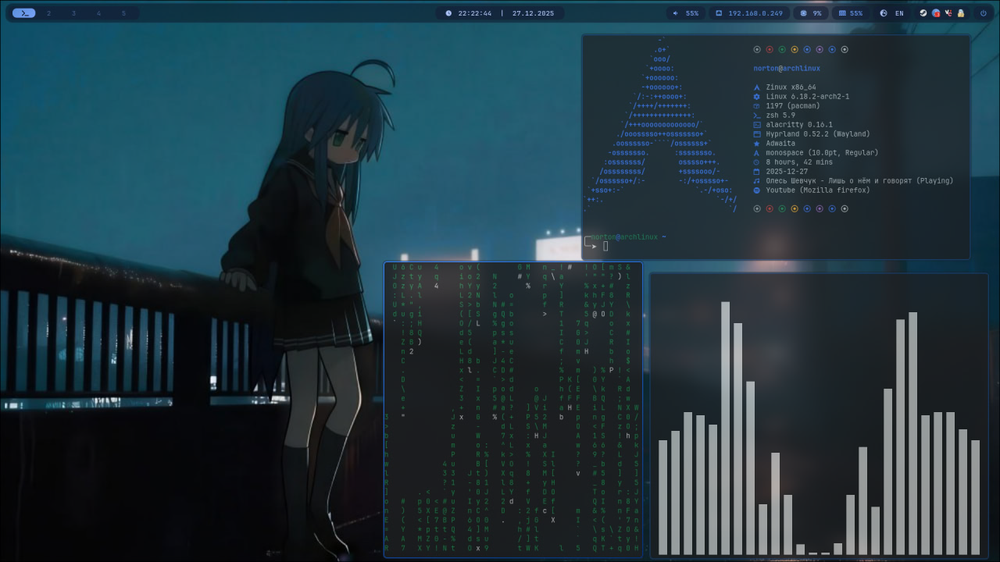

# My rice for Hyprland
 
 ## 

## -------------- INFO & REQUIREMENTS --------------

- 🔲Wayland compositor: Hyprland 0.52.2
- 🍫Bar: Waybar 0.14.0-5
- 🌅Wallpaper: hyprpaper 0.7.6-4
- 🚀Launcher: wofi 1.5.1-1
- 💻Terminal: Alacritty 0.16.1-1
- 🖥️Shell: zsh 5.9 (oh-my-zsh : theme gnzh)
- 🌐Browser: Firefox
- 📂File manager: dolphin
- Fonts: Font awesome & jetbrains mono

## -------------- INSTALL --------------
```bash
pacman -S hyprland hyprpaper waybar wofi alacritty zsh firefox otf-font-awesome ttf-jetbrains-mono dolphin git nano
```

After installing the packages, run the bash script

```bash
bash <(curl -s https://raw.githubusercontent.com/Norton42qq/hyprland-rice/main/install.sh)
```

If the script doesn't work, install it manually.

```bash
git clone https://github.com/Norton42qq/hyprland-rice
cd hyprland-rice
chmod +x install.sh
./install.sh
```

## -------------- SETTINGS --------------
After copying all the configuration files, you need to configure the monitors.

1. Let's go to `~/.config/hypr/`

2. We write 
```bash
nano hyprland.conf
```

3. Find the 4th line and enter your monitor parameters there (standard hyprland settings)
   `To see your monitor ID, type hyprctl monitors`

4. Save by pressing ctrl+x and go to the second file
```bash
nano hyprpaper.conf
```

5. Change the empty parameter to "," to your monitor's ID. 

Once you have installed rice, it is advisable to reboot the hyprland session or the computer itself.
